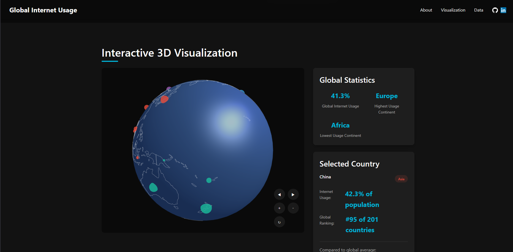

# Global Internet Usage 3D Visualization

Hey there! Welcome to my 3D data visualization project. I've created an interactive globe that lets you explore global internet usage statistics in a fun and engaging way. You can spin the globe, click on countries, and discover fascinating insights about how the world connects online.



## What You Can Do

- **Play with the Globe**
  - Spin it around, zoom in and out, and explore different regions
  - Click any country to see its internet usage stats
  - Hover over countries to get quick info
  - See clear outlines of countries and continents

- **Explore the Data**
  - Check out detailed stats for any country
  - See how continents compare to each other
  - Compare countries to the global average
  - Get detailed info in handy tooltips

- **Enjoy the Experience**
  - Works smoothly on any device
  - Beautiful animations and transitions
  - Easy on the eyes with a dark theme
  - Simple and intuitive controls

- **Discover Insights**
  - See how internet usage varies across continents
  - Find out which countries are leading the way
  - Compare regions and spot trends
  - Track changes over time

## Getting Started

### What You'll Need

- A web browser (Chrome, Firefox, Safari, or Edge)
- Node.js (version 14 or newer)
- npm or yarn (whichever you prefer)

### Get It Running

1. First, grab the code:
   ```bash
   git clone https://github.com/dmrph/global-internet-usage-viz.git
   cd global-internet-usage-viz
   ```

2. Install the dependencies:
   ```bash
   npm install
   # or
   yarn install
   ```

3. Fire up the development server:
   ```bash
   npm start
   # or
   yarn start
   ```

4. Open your browser and head to `http://localhost:3000`

## Behind the Scenes

- **The Tech Stack**
  - Three.js powers the 3D globe
  - React handles the user interface
  - Modern CSS makes it look great
  - D3.js helps crunch the numbers

- **The Data**
  - GeoJSON for the world map
  - World Bank data for internet stats
  - Some custom processing to make it all work together

## Where the Data Comes From

- World Bank Development Indicators
- International Telecommunication Union (ITU)
- United Nations Statistics Division

## Design Details

- Sleek dark theme with vibrant accents
- Looks great on any screen size
- Smooth animations everywhere
- Interactive elements that respond to your actions
- Clear, easy-to-read data displays

## Want to Help?

I'd love your help in making this project even better! Here's how you can contribute:

1. Fork the repository
2. Create your feature branch (`git checkout -b feature/YourGreatIdea`)
3. Make your changes
4. Push to your branch (`git push origin feature/YourGreatIdea`)
5. Open a Pull Request

## License


## About Me

Your Name
- LinkedIn: https://www.linkedin.com/in/dmrph/
- GitHub: https://github.com/dmrph

## Thanks

dmrph
# global-internet-usage-viz
